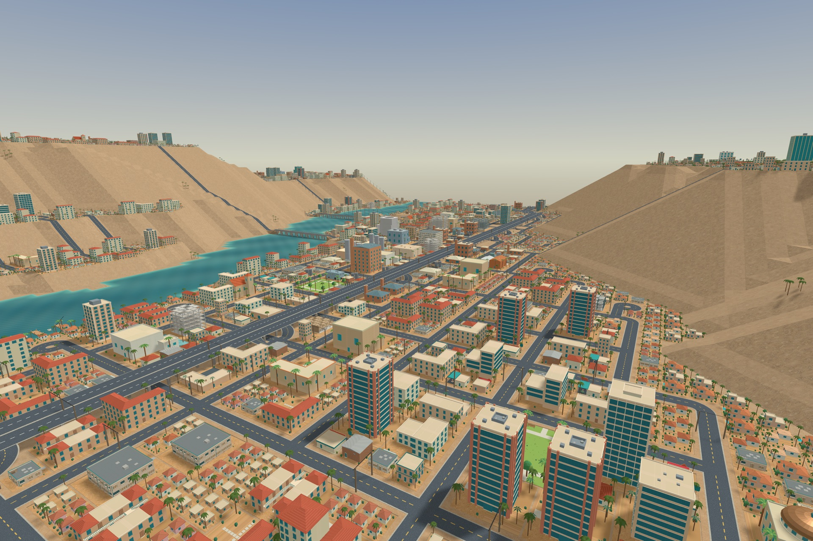

# Sin City - Desert Dreams

Build a city in the Mojave. Shape the land, zone neighborhoods and industry,
connect power and water, balance the budget, and guide a desert town through
booms, busts and disasters. Then step out of the mayor's office and walk, drive,
fly, sail or ride the train through the city you built.



Sin City - Desert Dreams (SC2D) is a free, open-source city builder that plays like SimCity 2000.
Every model, icon, illustration, line of writing and line of code is its own.
It runs on Godot 4.6.1 and is written in GDScript.

## Download

Builds for **macOS** and **Windows** are on the
[Releases page](https://github.com/sierra760/SinCityDesertDreams/releases).
Version 0.1 is an early release; expect rough edges.

| Platform | Package | Notes |
| --- | --- | --- |
| macOS 12 or later | `.dmg`, universal (Apple silicon and Intel) | Drag the app to Applications. If macOS says it can't verify the app, open **System Settings → Privacy & Security** and choose **Open Anyway**. |
| Windows 10/11, 64-bit (x64) | `.exe`, a single file | The game data is built into the `.exe`, so it runs from any folder. If SmartScreen appears, choose **More info → Run anyway**. A GPU with Vulkan support is recommended. |

The game works offline. It has no accounts, telemetry, ads or in-app
purchases, and saves and settings stay on your computer. The one online feature
is the optional real-world terrain chooser. While it is open it shows an
OpenStreetMap street map, searches OpenStreetMap's Nominatim service for a place
when you submit a search, and checks a small settings file on this project's
server that names those map and search providers. Downloading terrain
contacts two public elevation and water datasets. None of these services needs
an account, and nothing from the map or search is saved with a city.

There is no sound or music yet.

## What's in it

**City building**

- A 128×128 tile map with free terrain shaping before you found the city:
  raise and lower land, carve water, plant trees and set the sea level.
- Or start from real geography: **New City → Real-world terrain** downloads
  the elevation and mapped water for any square of land from 0.5 to 128 km
  across, Las Vegas by default. A street map and place search help you find
  the spot. See [real-world terrain](docs/design/real-world-terrain.md).
- Residential, commercial and industrial zones that grow, decline and respond
  to taxes, land value, pollution, crime, traffic and failed commutes.
- Power plants, power lines, pumps, pipes, water towers, treatment and
  desalination plants, with an underground view for pipes and subways.
- Roads, highways, on-ramps, road tunnels, bridges, rail, bus stations,
  subways, airports, seaports and marinas.
- Police, fire, hospitals, schools, colleges, prisons, parks and the other
  funded services, plus annual budgets, bonds, ordinances, eleven industrial
  sectors, neighboring cities and a city newspaper.
- Rewards, Gaming Resorts (this game's arcologies) and disasters: fires,
  floods, earthquakes, tornadoes, hurricanes, riots, chemical spills,
  meltdowns, volcanoes, plane crashes, microwave strikes and Tsawhawbitts, the
  basket-carrying giant from Nevada legend. **Go to Emergency** jumps to the
  incident.
- Eleven data map layers, graphs, population and industry reports.

**Look and feel**

- A 3D city with 144 original Blender building models, Las Vegas
  mid-century and atomic-age signage, palms, desert terrain and animated water.
- Desert Transit rail halls and subway stations with furnished platforms,
  lobbies and elevators.
- A warm ivory, teal and brass interface with BioRhyme lettering.
- **View → Street Names** names road segments. The names appear on street
  blades and highway exit signs in Explore, and nearby train and subway
  stations are named after them.

**Explore your city**

Choose **View → Explore City** to leave the aerial view:

- Walk as one of 18 pedestrian characters (Settings → General).
- Drive any of 17 vehicle types, from sedans and buses to fire engines, or fly
  the helicopter.
- Board a sailboat or harbor ship at a marina.
- Take an elevator down to a subway platform, walk aboard a train through its
  open doors, and ride along connected track.
- Drive through road tunnels and over bridges, and find your city's streets
  signposted.

Exploring never changes city data, funds or the simulation's random numbers.
Pause the city to explore without time passing. Vehicle and walker positions
last only for the session.

**Cities and saves**

- Nine ready-to-play cities appear in **Load City** as **Included city**:
  Adaven, Aliso Niguel, Foothills Ranch, Grant Pass - Soledad, La Presa,
  Lawndale, Oro Canyon, Salton Shores and Valle del Mar.
- **Import Classic City** opens your own SimCity 2000 `.sc2` cities. Export back
  to `.sc2` is not supported; progress saves as native `.sc2d`.
- **Share City** makes a playable copy to send to a friend. On macOS this opens
  the system Share menu; on Windows it shows the copy in File Explorer.
- Annual automatic backups, and a Save, Don't Save or Cancel prompt before
  you lose changes.
- Set your mayor's name in Settings; it greets you and travels with your cities.

## Controls

### Build

| Action | Default |
| --- | --- |
| Pan | Middle drag, two-finger trackpad swipe, WASD or arrow keys |
| Zoom | Mouse wheel, trackpad pinch, or `1`–`5` for the five zoom levels |
| Rotate | `R` |
| Build with the selected tool | Left drag |
| Inspect a site | Right-click, or `Q` for the Inspect tool |
| Temporary bulldozer | Hold `B` |
| Underground view | `U` |
| Pause / speed | `P` pauses and resumes at the previous speed; `+` and `-` or the Speed menu change speed |
| New, Load, Save, Save As, Settings | `Cmd`/`Ctrl` + `N`, `O`, `S`, `Shift`+`S`, `,` |
| Fullscreen | `F11` |
| Cancel a drag, clear the tool or close a window | `Escape` |

### Explore

| Mode | Controls |
| --- | --- |
| Walk | WASD or the arrow keys move; Shift sprints; Space jumps; the mouse orbits the camera. |
| Drive | W or Up accelerates; S or Down brakes, then reverses; A/D or Left/Right steer; Space is the handbrake. |
| Fly | WASD moves; Q climbs; E descends. Release the keys to hover. |
| Boat | Drive controls. Stop beside a berth or clear shoreline to leave. |
| Enter or leave | `F` near a vehicle, marina, elevator or call button. Stop or land first. |
| Menu | `Escape` opens and closes the Explore panel: Resume, vehicle choice, Recover, Return to Build. |

Game controllers are not supported; play with a keyboard and mouse or
trackpad, or with touch on iPhone and iPad. Every key can be reassigned in
**Settings → Controls**. Explore shows a short controls hint when you enter
and when you change modes. **Help → Playing the Game…** has a fuller guide.
See [customizing controls](docs/release/controls.md). Bored of being fiscally
responsible? Try **Help → Secret Codes…**.

### Display and performance

Settings offers an automatic interface size or 100% to 200%, High, Balanced
and Performance graphics quality, and 100%, 75% or 50% 3D resolution with sharp
interface text. On desktop the city pauses while the game is in the background;
turn that off in **Settings → General**. Large cities ask more of your
hardware, and the first trip into Explore can take a few seconds while the
city's 3D world is prepared.
See the [performance notes](docs/design/performance.md).

## Playing from source

Install the standard build of [Godot 4.6.1](https://godotengine.org/download/archive/4.6.1-stable/)
(no .NET needed), then open `game/project.godot` and press Play, or run:

```sh
godot --path game
```

Native geometry and city-sharing libraries are included for macOS and iOS.
Other platforms use equivalent GDScript code paths.

## Development

```sh
python3 tools/check_provenance.py
python3 tools/check_3d_assets.py
python3 tools/run_tests.py
```

The test runner uses an isolated project and test data. A run fails on any
assertion failure and on engine or resource diagnostics, including shutdown
leaks. Contributions are welcome; read [Contributing](CONTRIBUTING.md) first.

Further reading:

- [Simulation rules](docs/simulation/) and [architecture](docs/design/architecture.md)
- [3D art and models](docs/art/3d-models.md) and [content provenance](docs/design/provenance-policy.md)
- [Traffic and passenger transit](docs/design/traffic-and-passenger-transit.md),
  [street names](docs/design/street-names.md) and [marina boats](docs/release/marina-boats.md)
- [File formats](docs/design/file-formats.md) and the [roadmap](docs/design/roadmap.md)
- iPad and iPhone touch support is in progress; see [iPad](docs/release/ipad.md)
  and [iPhone](docs/release/iphone.md)

## FAQ

**Will this project continue to be maintained?**

Let's be real: many codebases these days grow very quickly and soon verge on
becoming unmaintainable because of how they were built (that is, vibe coding).
I have been working on this project internally for about two years; I am a
retired professor who taught software development, among other things. I have
the time, intent and knowledge to keep developing this project, and I plan to do so.

**Was agentic coding used in development?**

Absolutely! Agentic coding helps skilled software developers augment their capabilities.
I find it very useful because it lets me tackle larger projects than I could without a
development team working for me, while still maintaining full command over everything I
am building. It is not a replacement for judgment that only a skilled developer can provide,
and it was not used as a substitute for human decision-making on this project.

## Credits and license

Developed by **Sierra Burkhart (sierra760)**.
Copyright © 2026 **Bristlecone Artists LLC**.

Project-authored code is licensed under the **GNU GPL, version 3 or later**,
and comes with no warranty. See [LICENSE](LICENSE) and the
[licensing scope](LICENSING.md). The project's own art, models and included
cities are licensed under **Creative Commons Attribution-NonCommercial-ShareAlike
4.0** (CC BY-NC-SA 4.0): share and adapt them non-commercially, with credit, under
the same license. See [LICENSE-ASSETS](LICENSE-ASSETS).
The bundled BioRhyme and Atomic Age fonts are under the SIL Open Font License,
and Fontdiner Swanky is under the Apache License 2.0. The main menu's **License** button shows the full GPL
offline.

Real-world terrain uses elevation from the Mapzen/Joerd terrain tiles (USGS,
NOAA and other providers) and water from ESA WorldCover 2021 (CC BY 4.0). The
terrain chooser's street map and place search use map data © OpenStreetMap
contributors (ODbL 1.0). Full credits and terms ship with the game in
[`game/data/real_world_terrain_notices.txt`](game/data/real_world_terrain_notices.txt);
open them from **Help → Playing the Game… → Terrain data sources** or the
chooser's **Data sources** button.

Sin City: Desert Dreams is an independent project. It is not affiliated with or
endorsed by Maxis or Electronic Arts, and it contains none of their game assets
or supplied maps. SimCity and SimCity 2000 are trademarks of their respective
owners, named here only to describe the game's inspiration and `.sc2` import
compatibility.
